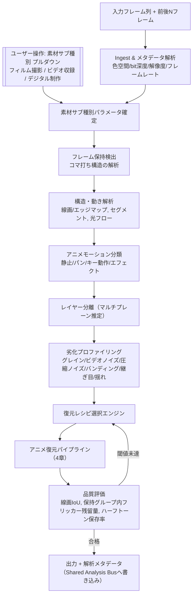

# DaVinci Resolve向け アニメ映像復元OpenFXプラグイン 特化設計書
### 実写章を除外し、アニメ復元に全面特化したアーキテクチャ再設計

作成日: 2026年7月13日
前提資料: 「映像復元・画質向上技術 総合調査レポート」「DaVinci Resolve向け映像復元OpenFXプラグイン群 統合設計書」（本セッション先行成果物）

**転換の理由**: 実写のデノイズ・超解像領域はNeat Video、Topaz Video AI等の資金力・データ量で先行する競合が既に多数存在し、正面から戦っても優位性を作りにくい。一方でアニメ復元は、2/3/4コマ打ちの離散的な動き、線画とベタ塗りの構造、エフェクト作画の扱いなど実写向けツールが正しく対応できていない固有課題が多く、技術的な差別化余地が大きい。本書ではアニメに全リソースを集中し、アーキテクチャと個別アルゴリズムをより深く詰める。

**表記ルール**: `【独自提案】` = 既存論文に明示的な先行研究が確認できていない設計提案。実装前に実データでのPoC検証が必須。`【統合提案】` = 既存研究・OSS実装の組み合わせによる設計。`【要検証】` = 特に不確実性が高く、最優先で仮説検証すべき項目。

---

## 1. アニメ映像の劣化・構造モデル（世代別整理）

アニメは制作方式によって劣化の性質がまったく異なる。実写のように「センサーノイズ」「レンズ収差」で一括りにできず、まず素材の来歴を正しく分解することが設計の出発点になる。

| 世代/方式 | 代表的な時代・例 | 動きの性質 | 支配的な劣化 | 実写手法の転用可否 |
|---|---|---|---|---|
| **セルアニメ・フィルム撮影** | 〜1990年代のTVアニメ・劇場作品、フィルムスキャン素材 | 2/3コマ打ちが基本、撮影台のセル揺れあり | フィルムグレイン、ダスト・傷、褪色、フリッカー（露光ムラ）、セル揺れ | 傷/ダスト検出・グレイン処理・褪色補正は転用可能。動き解析は転用不可 |
| **セルアニメ・ビデオ収録** | 1980〜2000年代前半のTV放送、アナログ/初期デジタル収録 | 同上（2/3コマ打ち） | フィルム由来の劣化はなし。代わりにアナログビデオノイズ、色にじみ（クロマブリード）、インターレース由来のコーミング、VHS/放送収録特有のブロックノイズ | フィルム系モジュール（グレイン、傷）は不要。デジタル圧縮系・インターレース解除の知見は転用可能 |
| **デジタル制作アニメ（初期）** | 2000年代のデジタル彩色・撮影 | 2/3コマ打ちが中心だが部分的に滑らかな動きが混在し始める | 圧縮ノイズ（放送・配信起因）、初期デジタル合成特有の色境界アーティファクト | 圧縮アーティファクト対応は転用可能 |
| **デジタル制作アニメ（現行）** | 現行TV・配信アニメ、レイヤー合成・エフェクト多用 | コマ打ちは維持しつつ、CG背景やエフェクトレイヤーは滑らかな動きを持つ（レイヤーごとに動きの性質が混在） | 配信圧縮（H.264/HEVC等）由来のブロック・モスキートノイズ、レイヤー合成継ぎ目、バンディング（グラデーション背景） | 圧縮系は転用可能。合成継ぎ目・バンディングはアニメ特有の対応が必要 |

**設計上の帰結**: `sourceMedia` パラメータ（プルダウン）は当初の「デジタル/フィルムスキャン」の2択では粒度が粗い。本書では以下の3択に拡張する。

- `セルアニメ・フィルム撮影`
- `セルアニメ・ビデオ収録`
- `デジタル制作`

この選択により、後述のモジュール群（セル揺れ補正、グレイン処理、インターレース解除、コンポジット継ぎ目除去等）の既定オン/オフが決まる。ユーザーが確定させる方針（前回設計からの変更なし）は維持する。

---

## 2. 共通解析基盤（アニメ専用再設計）

### 2.1 パイプライン図



### 2.2 各解析ステージの深掘り

#### フレーム保持検出（Frame-Hold Detection）— 詳細設計は3.1節
最初に実行する。これ以降の全解析（動き解析、モーション分類、劣化プロファイリング）が保持グループ単位を前提に効率化されるため、パイプラインの先頭に固定配置する。

#### 構造・動き解析
- **線画/エッジマップ**: XDoG（拡張差分ガウシアン）で線画候補を抽出し、細線化（thinning）でスケルトン化する。この結果は3.2節（セル/線画揺れ補正）と3.5節（領域認識型デノイズの境界保護）の両方から参照される共有データとして扱う。
- **セグメント（色領域）**: Lab色空間でのk-meansまたは色量子化による флат領域分割。アニメは実写と異なり色数が少ないため、汎用的なsuperpixel手法より高速かつ安定して動作する。
- **光フロー**: 保持グループ内は計算をスキップ（動きゼロ確定）。グループ境界のみRAFT系またはブロックマッチングで計算し、計算対象フレーム数を大幅に削減する。

#### アニメモーション分類・レイヤー分離
3.3節・3.4節で詳述。この2つは同じ光フロー場を入力とするため、実装上は一体のモジュールとして設計し、モーション分類の出力（クラスタリング結果）をそのままレイヤー分離の初期値として使い回す。

#### 劣化プロファイリング（アニメ特化版）

| 劣化 | 検出方法 | 対応モジュール |
|---|---|---|
| フィルムグレイン | 高周波・時間非相関成分のスペクトル解析（実写と共通の手法を転用） | グレイン分離・再合成（実写設計を流用） |
| アナログビデオノイズ・色にじみ | クロマ/ルマの空間解像度差の検出、インターレース残留検出 | ビデオノイズ除去＋デインターレース（新規、3.9節） |
| 圧縮ノイズ（ブロック/モスキート） | ブロック格子相関、フラット領域境界での不自然な輝度段差検出 | アニメ特化デブロック（3.9節、実写版と異なりフラット背景での視認性を重視） |
| バンディング | ビット深度不足の検出（局所的な階調ヒストグラムの離散化度合い） | バンディング対応グラデーション再構成（3.8節） |
| コンポジット継ぎ目 | レイヤー境界に沿った不自然なアンチエイリアシング不整合の検出 | コンポジット継ぎ目除去（3.7節、【独自提案】） |
| ハーフトーン/スクリーントーン | 周波数領域の周期的自己相関ピーク検出 | スクリーントーン保護（3.6節、【独自提案】） |
| セル/線画揺れ | 保持グループ内での線画スケルトン位置ズレの計測 | セル/線画揺れスタビライザー（3.2節） |

### 2.3 Shared Analysis Bus（アニメ文脈での意義）

前回設計（1.3節相当）のコンセプトを踏襲。アニメ復元では特に「線画/エッジマップ」「保持グループマップ」「レイヤー分離結果」の3つが複数モジュールから繰り返し参照されるため、これらをキャッシュすることによる計算削減効果が実写版より大きい（実写では光フローの共有が主目的だったが、アニメでは軽量な解析結果を多数のモジュールが再利用する構造になる）。

---

## 3. コア独自モジュール詳細設計

### 3.1 フレーム保持検出（深掘り）

前回設計の擬似コードに加え、以下の3点を深掘りする。

**(a) コマ打ちヒストグラムによるショット単位の構造把握**
保持グループ長（1, 2, 3, 4...）の頻度分布をショット単位で集計し、「このショットは基本2コマ打ちだが、クライマックスカットのみ1コマ打ちで滑らかに動いている」といった演出意図を検出する。これにより、後段のレシピ選択エンジンがショット全体に一律のパラメータを適用するのではなく、演出上重要な部分（1コマ打ち区間）とそれ以外を区別して処理強度を変えられる。

**(b) 境界信頼度スコア**
保持グループの境界判定（3.2節前回擬似コードの `SIM_THRESH` 判定）は、圧縮ノイズが強い素材やエフェクトが重なるフレームでは誤判定しやすい。単純な二値判定ではなく、境界らしさを0〜1の連続値として保持し、後段処理（特に時間デノイズの強度）を境界信頼度に応じて滑らかに変化させる設計とする。信頼度が低い境界は「保持グループとして扱うが、時間平均の重みを弱める」というグレースケール的な扱いにする。

**(c) 混在ケースへの対応 `【要検証】`**
実際の商業アニメでは、同一カット内でもキャラクター（2コマ打ち）と背景パン（連続的な動き）が同時に存在し、フレーム全体で単一の「保持長」を割り当てることができない。そのため、フレーム保持検出は**フレーム全体ではなく領域単位（3.4節のレイヤー分離結果）で個別に行う**設計に拡張する。背景レイヤーは連続動作として扱い、前景セルレイヤーのみ保持グループ判定を行う。この領域単位の保持検出は前回設計になかった重要な拡張であり、実装難易度も上がるため最優先で仮説検証すべき項目としてマークする。

### 3.2 セル/線画揺れスタビライザー（深掘り）

**ワープモデルの選択**: 前回は「サブピクセルワープ」とだけ記述したが、実際には劣化の物理的原因によって適切なワープモデルが異なる。

| 原因 | 想定されるズレの性質 | ワープモデル |
|---|---|---|
| 撮影台のフィルムゲート振動 | フレーム全体の一様な並進・微小回転 | 剛体変換（並進＋回転、2〜3パラメータ） |
| 紙原稿の位置決めピン穴の摩耗 | フレームごとに独立したランダムな並進 | 並進のみ（1パラメータ、最も安定） |
| 紙原稿自体の伸縮・反り | 非一様な局所変形 | Thin-Plate Spline等の非剛体変形（線画スケルトン上の複数対応点が必要） |

実装は**剛体変換を既定**とし、線画スケルトンの相関ピークが複数箇所で有意にズレる（＝紙の反りが疑われる）場合のみ非剛体変形にフォールバックする段階的設計とする。非剛体変形は計算コストが高くパラメータ推定も不安定なため、既定でオフにし上級者向けオプションとする。

**線ボイル（Line Boil）との区別 `【独自提案・要検証】`**: 一部の作品では、線画の微小な揺れそのものが意図された表現技法（手描きの温かみを出す「線ボイル」）として使われている。本モジュールがこれを一律に除去すると作品の演出意図を破壊する。区別のための設計案:

- 線ボイルは通常、**フレームごとにランダムかつ小振幅**（撮影台振動のような系統的な一様ズレではなく、線の各部位が独立に微小変形する）という統計的特徴を持つ。
- セル揺れは**フレーム全体で一貫した並進・回転成分**を持つ。
- 3.2節スタビライザーの推定結果（フレーム全体の一貫したオフセット量）と、線画各部位の残差変形量を分離して計測し、前者のみを補正対象とし、後者（線ボイル的な非一貫成分）は補正しないという設計方針を取る。ただし実際の線ボイル表現との統計的な切り分けが可能かは未検証であり、誤って演出意図を消してしまうリスクがあるため、**本モジュールは既定で「弱」強度とし、強い補正はユーザーの明示的な操作を要求する**保守的な設計とする。

### 3.3 アニメモーション分類（深掘り）

**特徴量設計**:
- 局所光フローのアフィン一貫性（近傍領域内でのフロー場の分散）→ 背景パン領域の判定に使用
- フレーム保持マップとの整合性（保持グループ境界と一致した動きか）→ キー動作（ステップ動作）の判定に使用
- 時間分散の正規化値（局所コントラストで正規化した輝度分散。単純な分散だとエッジ部分が常に高く出るため、コントラストで正規化することでノイズ・エフェクトと構造的な高コントラスト部分を区別する）→ エフェクト作画の判定に使用
- 周波数領域の周期性（3.6節のスクリーントーン検出と共用）→ スクリーントーン領域を「エフェクト」と誤分類しないための補助特徴

**分類器の設計方針**: 前回設計と同様、まずルールベース（各特徴量への閾値）で実装し、複合的なケース（エフェクトが背景パン領域に重なる等）に対応するため、将来的に軽量CNN分類器（4クラス、入力は小パッチ＋時間窓3〜5フレーム）へ置き換え可能な構造とする。学習データは自作のアノテーション（実際のアニメ素材に4クラスのマスクを手動付与）が必要になる見込みで、これはコストの高いタスクとして開発ロードマップ（7章）で明示的に計画する。

### 3.4 マルチプレーン背景前景分離（深掘り・理論的裏付けの補強）

**理論的基盤**: 本モジュールの発想は、Wang & Adelson, "Representing Moving Images with Layers," IEEE Transactions on Image Processing, Vol.3, No.5, 1994（DOI: 10.1109/83.334981）が提案した「レイヤード動き表現」に基づく。同論文は、動画を複数の重なり合うレイヤー（各レイヤーは強度マップ・アルファマップ・速度マップを持つ）に分解する古典的フレームワークであり、アニメのマルチプレーン撮影（背景と前景セルが独立して動く）という構造は、このレイヤード表現の理想的な適用対象と言える。本モジュールはこの古典的アイデアをアニメの文脈（保持グループ構造、コマ打ち）に合わせて再設計する試みであり、レイヤー分解アルゴリズム自体は現代的な手法（RANSACによるアフィン一貫性クラスタリング、または反復的なレイヤー割当）で実装する。

**実装方針**:
1. 光フロー場を複数のアフィンモデル（背景パン用に1〜2個、前景セル用に可変数）でRANSACフィッティングし、各画素をどのモデルに最も適合するかでクラスタリングする。
2. クラスタ境界はハードなセグメンテーションではなく、**モデル適合度に応じたソフトウェイト**として保持する（オクルージョン境界や半透明効果での破綻を避けるため）。
3. 背景レイヤーには実写的なMC-SR、前景レイヤーには保持グループ認識型処理を独立に適用し、最終的にソフトウェイトでブレンドして合成する。

**既知の限界**: 3層以上のマルチプレーン（多重の背景美術＋複数キャラクターレイヤー）や、レイヤー間の半透明合成（光源エフェクト等）が多い現代デジタル作品では、レイヤー分離の精度が大きく低下することが予想される。本モジュールは**背景パン＋前景セルの2層分離を主要ターゲット**とし、それ以上の複雑な合成には対応しない設計スコープとすることを明記する。

### 3.5 領域認識型デノイズ（深掘り）

**セグメンテーション具体アルゴリズム**: Lab色空間でのk-means（クラスタ数はショットごとの色ヒストグラムのピーク数から自動推定、目安10〜30クラスタ）を一次実装とする。フラット領域はクラスタ内分散が極めて小さくなるため、クラスタごとに「フラット度スコア」（クラスタ内分散の逆数）を計算し、フラット度が高い領域ほど強い平滑化を適用する。

**境界フォールオフ**: 前回設計では線画マスクによる「保護」とだけ述べたが、ハードマスクだと境界に不自然な段差が生じる。線画スケルトンからの距離変換（distance transform）を計算し、距離に応じて平滑化強度を連続的に減衰させるソフトフォールオフとして実装する（線画から離れるほど強く平滑化、線画に近づくほど弱める）。

### 3.6 スクリーントーン・ハーフトーン保護 `【独自提案・新規】`

**課題**: 一部のアニメ・マンガ原作由来の作品では、意図的な網点（ハーフトーン）パターンやスクリーントーン調のテクスチャが背景・陰影表現に使われる。これは規則的な高周波パターンであり、汎用のデノイズ・デブロック処理からは「圧縮ノイズ」や「モアレ」と区別がつかず、誤って平滑化・除去されるリスクがある。

**検出方法**: 局所領域の自己相関関数を計算し、規則的な間隔でピークが現れるかを判定する（圧縮ノイズやランダムノイズは自己相関が急速に減衰するのに対し、規則的パターンは周期的にピークを持つ）。この処理はデノイズ前の解析パスとして、劣化プロファイリング段階（2.2節）に組み込む。

**対応方針**: スクリーントーン領域と判定された領域は、劣化分解ルーターの対象から除外する（デノイズ・デブロックの適用強度を大幅に下げる、または完全にスキップする）専用マスクとして扱う。ただし配信圧縮によってスクリーントーンパターン自体が劣化しているケース（モスキートノイズがパターンに重畳している）では、パターンを保持しつつノイズのみ除去するという、より繊細な処理が必要になる可能性があり、これは今回のスコープでは「既知の未解決課題」として明記するに留める。

### 3.7 コンポジット継ぎ目除去（デジタル制作アニメ特有）`【独自提案・新規】`

**課題**: デジタル制作（レイヤー合成）されたアニメでは、キャラクターセル・背景・エフェクトレイヤーの境界でアンチエイリアシングの不整合（レイヤーごとに異なるアンチエイリアシング設定でレンダリング/書き出しされた結果、境界にわずかな色ズレやハロが生じる）が発生することがある。これは線画そのものではなく、合成処理由来の人工物である。

**検出方法**: 線画エッジマップ（XDoG由来）と実際の色境界を比較し、線画として検出されていないにもかかわらず不自然に鋭い色境界が存在する箇所を「合成継ぎ目候補」として抽出する。線画由来の境界（意図された輪郭線）と区別するため、境界の幅・コントラスト勾配の急峻さのプロファイルを比較する（合成継ぎ目は通常1〜2px程度の非常に狭い不整合として現れる）。

**対応方針**: 検出箇所に限定してGuided Filterベースの局所的な平滑化を適用し、境界を目立たなくする。誤検出（意図的な線画エッジを継ぎ目と誤認）のリスクがあるため、既定では弱い強度に留め、ユーザーが明示的にマスクを確認・調整できるUIを想定する。**本モジュールは現時点で参照できる先行研究がなく、完全に本書独自の提案である**ことを明記する。

### 3.8 バンディング対応グラデーション再構成（深掘り）

古典的なデバンディング手法（f3kdb等で採用される、疑似乱数ディザリングによる階調再構成）をベースラインとしつつ、アニメ特有の設計拡張として以下を加える。

- グラデーション領域は3.5節のセグメンテーション結果から特定できる（フラット領域ほど分散は低いが完全にゼロではなく、輝度が空間的に単調変化する領域として区別可能）。
- 領域境界（グラデーションから隣接するフラット色領域・線画への遷移部）では、ディザリングのノイズプロファイルが不自然に途切れないよう、3.5節のフォールオフと同じ距離変換ベースの重み付けを再利用する。
- ビット深度不足が原因のバンディング（8bit配信素材等）では、単純なディザ付加だけでなく、周辺フレーム（保持グループ内）から追加の階調情報をサブピクセル単位でサンプリングし再構成する多フレーム的アプローチも検討可能だが、これは効果が限定的な可能性が高く `【要検証】` として次点の優先度に位置付ける。

### 3.9 圧縮ノイズ対応（アニメ特化の設計論拠）

実写と同じ「ブロック格子検出＋エッジ適応平滑化」の枠組みを流用するが、アニメでは**フラットな背景に対するブロック境界の視認性が実写よりはるかに高い**（実写ではテクスチャに紛れて目立ちにくいブロックノイズが、アニメの単色ベタ塗り背景ではくっきりと段差として見える）という違いがある。このため、フラット領域（3.5節のフラット度スコアが高い領域）でのブロック境界検出の感度を実写設計より高く設定し、平滑化強度も強めに設定する。

また、セルアニメ・ビデオ収録由来の素材（1章参照）ではインターレース由来のコーミングノイズが加わるため、圧縮ノイズ処理の前段に古典的な動き適応型デインターレース（フィールド単位の動き検出＋補間）を追加する。この処理は`sourceMedia`が「セルアニメ・ビデオ収録」の場合のみ既定で有効化する。

---

## 4. 復元パイプライン全体構成（実行順序）

```
入力
 → 素材サブ種別パラメータ確定（フィルム撮影 / ビデオ収録 / デジタル制作）
 → フレーム保持検出（ショット単位、将来的には領域単位に拡張 [3.1(c)]）
 → 構造解析（線画/エッジマップ、色セグメント）
 → アニメモーション分類 + マルチプレーン背景前景分離（3.3, 3.4）
 → [ビデオ収録のみ] 動き適応デインターレース
 → 劣化プロファイリング（グレイン/ビデオノイズ/圧縮ノイズ/バンディング/継ぎ目/揺れ/スクリーントーン検出）
 → [フィルム撮影のみ、既定弱] セル/線画揺れスタビライザー（3.2）
 → 領域認識型デノイズ（エフェクト領域・スクリーントーン領域は除外）（3.5, 3.6）
 → アニメ特化デブロック/デアーティファクト（3.9）
 → バンディング対応グラデーション再構成（3.8）
 → [デジタル制作のみ] コンポジット継ぎ目除去（3.7）
 → 線画保護型シャープ（保持グループ境界のみ）
 → アニメ特化超解像（Real-CUGAN/APISR系アーキテクチャを参考にしたモデル）
 → 色復元（褪色補正、キーフレーム誘導伝播）
 → 品質評価（線画IoU、保持グループ内フリッカー残留量、ハーフトーン保存率）
 → [必要なら] レシピ再選択・再処理
 → 出力
```

---

## 5. OpenFX実装設計（アニメ特化版・更新）

| モジュール | GPU負荷 | 追加VRAM目安 | リアルタイム性 | 必要フレーム範囲 | ROI拡張 | 備考 |
|---|---|---|---|---|---|---|
| フレーム保持検出（ショット単位） | 低 | 低 | ◎（解析パスで事前計算） | ショット全体を一度に解析推奨 | 時間方向大 | 結果はShared Analysis Busにキャッシュし全モジュールで再利用 |
| フレーム保持検出（領域単位拡張）`【要検証】` | 中 | 中 | △ | ショット全体 | 時間方向大＋空間セグメント情報 | 実装難易度が高く優先度は次点 |
| 線画/エッジマップ・色セグメント抽出 | 低 | 低 | ◎ | 1 | なし | 全モジュールが参照する基礎データ、最優先でキャッシュ化 |
| アニメモーション分類 | 低〜中 | 低 | ○ | 前後2〜3フレーム | 小 | ルールベース実装であれば軽量 |
| マルチプレーン分離（RANSAC） | 中 | 中 | △ | 前後数フレーム | 空間全体 | RANSAC反復回数が支配的コスト、プレビュー時は反復数を削減 |
| デインターレース | 低〜中 | 低 | ◎ | 前後1〜2フレーム | 時間方向小 | 古典的手法で十分、AI不要 |
| セル/線画揺れスタビライザー | 低〜中 | 低 | ○ | 保持グループ全体 | 時間方向（グループ長） | 剛体変換モデルなら軽量、非剛体は要注意 |
| 領域認識型デノイズ | 低〜中 | 低 | ◎ | 1（フラット領域処理は空間内完結） | カーネル半径分 | Guided Filterベースのため高速 |
| スクリーントーン検出 | 低 | 低 | ○（解析パスで十分） | 1 | 自己相関計算窓分 | 誤検出対策のためショット単位で安定化 |
| アニメ特化デブロック | 低〜中 | 低 | ◎ | 1 | ブロック境界近傍のみ | フラット領域限定処理でGPU負荷を抑制 |
| バンディング対応再構成 | 低〜中 | 低 | ◎ | 1（多フレーム拡張時は保持グループ分） | 小 | ディザリングベースであれば軽量 |
| コンポジット継ぎ目除去 | 低 | 低 | ◎ | 1 | 検出境界近傍のみ | 局所処理限定 |
| アニメ特化超解像（AI） | 中〜高 | 中 | △ TensorRT最適化で準リアルタイム可 | 1〜数フレーム | モデル受容野分 | Render Scale≠1時は古典アップスケールにフォールバック |
| 色復元 | 低 | 低 | ○ | キーフレーム参照時のみ広範囲 | なし〜大（キーフレーム伝播時） | 伝播距離が長い場合はオフライン専用 |

**キャッシュ・タイル・マルチスレッド・Render Scale方針**: 前回設計（統合設計書 5.2〜5.5節）の方針をそのまま踏襲する。アニメ特化により追加すべき点は、線画/エッジマップと色セグメントが極めて多くのモジュールから参照される「一級市民」データになったため、**Shared Analysis Busのキャッシュ優先度を、光フローよりも線画/エッジマップ・色セグメントを上位に置く**設計変更のみである。

---

## 6. プラグイン構成案（アニメ特化版）

アニメ専用に領域を絞ったことで、実写込みの広範な構成（統合設計書6章）よりも一貫性の高いプラグインラインナップが可能になる。

| プラグイン名 | 内包モジュール | 位置付け |
|---|---|---|
| **Anime Restore Core** | フレーム保持検出、構造解析、アニメモーション分類、領域認識型デノイズ、デブロック、バンディング対応再構成 | 主力プラグイン。単体で「基本的なクリーンアップ」を完結させる |
| **Anime Cel/Line Stabilizer** | セル/線画揺れスタビライザー | フィルム撮影素材向けの専用ツール。Core とは独立して単体使用も可能にする（Core を使わずスタビライズだけしたいニーズに対応） |
| **Anime Super Resolution** | アニメ特化超解像 | GPU負荷が高く独立したノードとして扱う方が制御しやすいため分離 |
| **Anime Color Restore** | 褪色補正、キーフレーム誘導色伝播 | フィルム撮影・旧作リマスター向けの専用ツール |
| **Anime Composite Cleanup** | コンポジット継ぎ目除去 | デジタル制作アニメ向け、対象が限定的なためニッチな独立プラグインとする |

**設計判断**: 実写込みの統合設計書ではハイブリッド型（共有ライブラリ＋複数フロントエンド）を推奨したが、アニメ特化版でも同じ方針を維持する。ただし対象領域が狭まった分、**Anime Restore Core 1本でも実用上の主要ユースケースをカバーできる**ため、まずはCore単体をMVP（Minimum Viable Product）として先行開発し、Stabilizer/SR/Color Restore/Composite Cleanupは需要検証しながら追加していく段階的リリースが現実的である（7章ロードマップに反映）。

---

## 7. 開発ロードマップ（アニメ特化版）

前回のロードマップ（統合設計書7章）をアニメ専用に再定義する。実装環境（Python先行検証かOFX直接実装か）は今回のスコープでは未決定のため、各フェーズは「何を検証・実装するか」の技術内容に絞って記述する。

### フェーズ1: 基盤構築
- 線画/エッジマップ抽出（XDoG＋細線化）、色セグメンテーション（Lab k-means）の実装と、実際の多様なアニメ素材（フィルム撮影/ビデオ収録/デジタル制作それぞれのサンプル）での精度検証
- フレーム保持検出（ショット単位）の実装。コマ打ちヒストグラムの妥当性を実素材で確認
- 領域認識型デノイズ（線画保護つきGuided Filter）の実装
- `sourceMedia` 3択プルダウンパラメータの実装とクリップ単位永続化

### フェーズ2: 独自コアモジュールの検証
- セル/線画揺れスタビライザー（剛体変換版）の実装と、線ボイルとの誤判定リスクの実素材検証 `【要検証】`
- アニメモーション分類（ルールベース）の実装。特にエフェクト作画の誤検出率を重点的に評価
- スクリーントーン検出の実装と、既存作品での誤検出率の評価
- バンディング対応再構成の実装（f3kdb等既存手法との品質比較ベンチマーク）

### フェーズ3: レイヤー分離とAI復元コアの統合
- マルチプレーン背景前景分離（RANSACベース）の実装。2層分離を最初のターゲットとし精度を評価
- コンポジット継ぎ目除去の実装（デジタル制作アニメサンプルでの検証、現時点で先行研究がないため慎重に評価）
- アニメ特化超解像モデルの統合（Real-CUGAN/APISR系アーキテクチャを参考に、自前データでのファインチューニングを計画）
- 品質評価指標（線画IoU、保持グループ内フリッカー残留量、ハーフトーン保存率）の実装

### フェーズ4: 高度化と統合
- フレーム保持検出の領域単位拡張 `【要検証】`（3.1(c)、優先度は状況次第で後ろ倒しも検討）
- 色復元（褪色補正、キーフレーム誘導伝播）の実装
- Shared Analysis Busの本実装（線画/エッジマップ・色セグメントキャッシュを最優先）
- モーション分類・スクリーントーン検出の学習ベース分類器への置き換え検討（要アノテーションデータ整備）

### 製品版
- Anime Restore Core を主力としたMVPリリース、Stabilizer/SR/Color Restore/Composite Cleanupの需要検証による段階的追加
- 実際のアニメ制作会社・リマスター事業者・ファンコミュニティ（AmusementClub等の実務コミュニティ）からのフィードバック収集
- ライセンス監査（参照実装として使用したOSSのライセンス確認、AI学習データの権利関係確認）

---

## 8. リスク・注意点・未検証事項一覧

- `【要検証】`とマークした項目（領域単位フレーム保持検出、線ボイルとの区別、コンポジット継ぎ目除去、多フレームバンディング再構成）は、実データでの検証結果次第で設計の見直しが必要になる可能性が高い。特に線ボイルとの区別は、演出意図を破壊するリスクが直接品質評価に直結するため最優先で検証すべきである。
- スクリーントーン保護・コンポジット継ぎ目除去は本書独自の提案であり、対応する先行研究や参照実装が存在しない。実装難易度・実効性ともに未知数であることを明記する。
- マルチプレーン分離は2層分離を主要ターゲットとしており、3層以上の複雑な合成やエフェクト多用シーンでは精度低下が予想される。対応範囲を明示的にユーザーへ伝えるUI設計（「この処理はシンプルな背景/前景の分離を想定しています」等の説明）が必要になる。
- アニメモーション分類・スクリーントーン検出の学習ベース分類器への移行には、アノテーション付きデータセットの整備が必要であり、これは公開データセット（ATD-12K等）だけではカバーしきれず、自前でのデータ収集・アノテーション工数を開発ロードマップに明示的に組み込む必要がある。
- 本書は前回ご指定の通り「設計のみを深める」段階の成果物であり、実装環境（Python先行検証かOFX直接実装か）の決定はまだ行っていない。次のステップとしてこの決定を行うことを推奨する。
